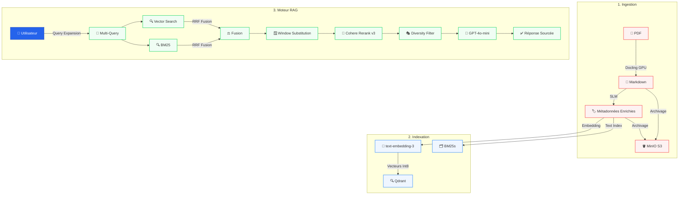

# 🏗️ Architecture Technique - DeepInsight RAG

Ce document détaille le pipeline technique exhaustif mis en œuvre pour le projet Theses-DeepInsight.

## 🔄 Flux de Données (End-to-End)

Le schéma ci-dessous détaille les trois phases du pipeline : Ingestion, Indexation et Moteur RAG.

## 🛠️ Détails des Composants & Expertise Technique

### 1. Phase d'Ingestion
**Objectif** : Transformer le chaos des PDF en données structurées et enrichies.
- **IBM Docling (GPU)** : Contrairement aux parseurs classiques qui extraient le texte linéairement, Docling utilise des modèles de vision pour comprendre la mise en page (tableaux complexes, multi-colonnes, en-têtes) et exporte un Markdown structuré fidèle à la source.
- **Enrichissement SLM (Local)** : Un modèle de langage léger (Small Language Model comme Phi-3 ou Mistral-7B) analyse le texte en local avant toute indexation pour extraire des métadonnées critiques (universités, disciplines, dates de soutenance) et générer des résumés sémantiques. Cela garantit la confidentialité et booste la pertinence de la recherche.
- **Archivage MinIO S3** : Sanctuarisation des documents originaux et de leurs versions Markdown dans des buckets sécurisés pour une traçabilité et une reproductibilité totale du pipeline.

### 2. Phase d'Indexation
**Objectif** : Créer des index multi-modaux pour une recherche hybride ultra-rapide.
- **OpenAI text-embedding-3** : Conversion des segments de texte en vecteurs mathématiques de 1536 dimensions capturant les relations sémantiques entre les concepts.
- **Qdrant (Vecteurs Int8)** : Base de données vectorielle configurée avec la *quantification scalaire*. En stockant les vecteurs en Int8 plutôt qu'en Float32, nous réduisons l'empreinte mémoire par 4 et accélérons la recherche, tout en maintenant une précision de récupération supérieure à 99% par rapport aux vecteurs bruts.
- **Index BM25s** : Algorithme de recherche lexicale ultra-performant. Il permet de pallier les faiblesses des embeddings sur les noms propres, les acronymes ou les termes techniques rares en recherchant les occurrences exactes de mots.

### 3. Moteur RAG (Retrieval-Augmented Generation)
**Objectif** : Générer une réponse véridique, sourcée et argumentée à partir du contexte récupéré.
- **Multi-Query Expansion** : Pour chaque question utilisateur, le système génère 3 variantes sémantiques afin de couvrir un spectre de recherche plus large et ne pas rater d'informations cruciales.
- **Hybrid Search & RRF Fusion** : Utilisation de l'algorithme *Reciprocal Rank Fusion*. Il combine et pondère les résultats provenant de la recherche vectorielle (sens) et de la recherche lexicale (mots) pour faire émerger les documents les plus robustes.
- **Post-Processing Avancé** :
    - **Window Substitution** : Technique permettant de récupérer un segment court mais de présenter au LLM une "fenêtre" de texte plus large autour de ce segment pour une meilleure compréhension du contexte.
    - **Cohere Rerank v3** : Utilisation d'un modèle "Cross-Encoder" qui ré-évalue la pertinence de la paire (Question, Document) pour ordonner les 5 meilleurs extraits avec une précision chirurgicale.
    - **Filtre de Diversité** : Algorithme s'assurant que les extraits choisis ne sont pas redondants, afin d'offrir au LLM un panorama complet du sujet traité.
- **Génération GPT-4o-mini** : Synthèse finale orchestrée par un "System Prompt" anti-hallucination. Le modèle a l'obligation stricte de ne répondre qu'en utilisant les sources fournies et de citer explicitement ses sources.
