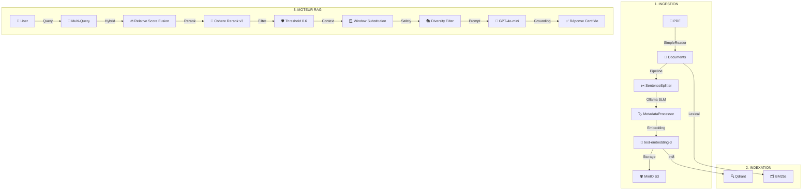

# 🏗️ Architecture & Flux de Données - DeepInsight RAG

Ce document présente une vision holistique du fonctionnement de la plateforme DeepInsight, de l'ingestion brute à la génération de réponses certifiées.

## 🔄 Schéma Global du Pipeline

Le projet est structuré en trois phases majeures, garantissant la souveraineté des données et la fidélité des réponses.

---

## 🛠️ Expertise Technique par Phase

### 📥 Phase 1 : Ingestion & Souveraineté
*   **IBM Docling** : Utilisation de modèles de vision IA pour transformer des PDFs académiques complexes (tableaux, formules) en Markdown propre.
*   **SLM Local (Small Language Model)** : Extraction de métadonnées (Universités, Dates, Disciplines) via Ollama pour éviter les coûts d'API et garantir la confidentialité.
*   **MinIO** : Infrastructure S3 auto-hébergée permettant une gestion granulaire des documents par "Thèmes".

### 🗂️ Phase 2 : Indexation Hybride
*   **Quantification Scalaire (Int8)** : Optimisation de Qdrant pour réduire l'empreinte mémoire par 4 sans perte de précision.
*   **Recherche Hybride** : Combinaison de la puissance sémantique (Embeddings) et de la précision lexicale (BM25) pour ne rater aucun terme technique.

### 🤖 Phase 3 : Moteur RAG Haute Fidélité
*   **Multi-Query** : Reformulation des questions pour explorer plusieurs angles de recherche.
*   **Cohere Rerank v3** : Ré-évaluation chirurgicale de la pertinence des extraits avant la génération.
*   **Window Substitution** : Fournit au LLM le contexte entourant chaque extrait pour une compréhension profonde de l'argumentation.
*   **Anti-Hallucination** : System prompt durci imposant la citation systématique des thèses sources.

---

## 👑 Gouvernance & Observabilité
Le projet intègre un **Cockpit Admin (Streamlit)** dédié à la surveillance :
- **Health Pulse** : Monitoring en temps réel de Qdrant, MinIO et Arize Phoenix.
- **Audit Dual Ragas** : Évaluation automatique de la **Fidélité** (Faithfulness) et de la **Pertinence** (Relevancy) sur des benchmarks ou des traces réelles.
- **Arize Phoenix** : Traçabilité complète de chaque requête pour debug et optimisation fine.
